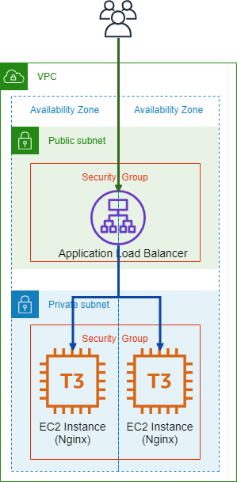

aws-cdk-example
====

An example of AWS CDK shown in following articles.

* http://it-akumi.hatenablog.com/entry/2019/08/26/204310
* https://qiita.com/it-akumi/items/df57cc5d28a3c7b50f3a

This example consists of 2 stacks, NetworkStack and ComputeStack, which work as below.



You can access Nginx via DNS name of Application Load Balancer.

## Build

```
$ npm install
$ npm run build
```

## Run tests

```
$ npm run build
$ npm test
```

## Deploy

```
$ npm run cdk deploy "*"
```

Use `--context` option to customize stacks.

```
$ npm run cdk deploy "*" -- --context env=production --context key=YOUR_KEY
```

## Author

[Takumi Ishii](https://github.com/it-akumi)

## License

[MIT](https://github.com/it-akumi/aws-cdk-example/blob/master/LICENSE)
